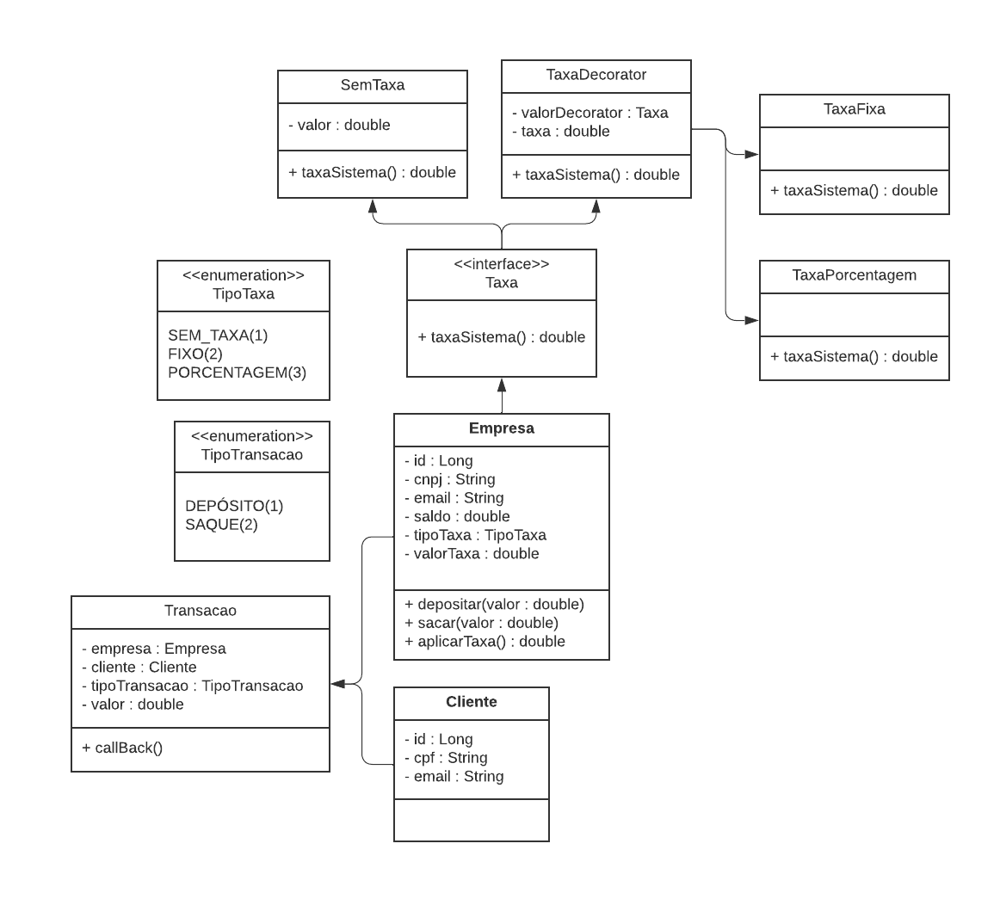

# API de transação de empresas e clientes.
* Projeto API REST com Spring Boot.

# UML do projeto:

### Tecnologias usadas:
* Spring Boot para a criação da API REST.
* Banco de dados H2.
* Design Pattern Decorator para a elaboração das classes de taxas personalizadas.
* Utilização da biblioteca JavaMailSender do Spring para envio de e-mails.
* Java 17.
